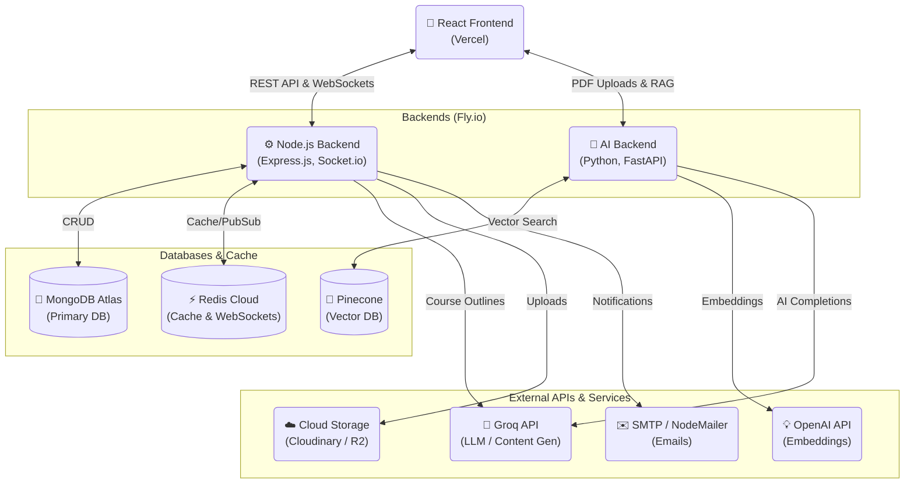

# Edulume - AI-Powered Educational Platform

<div align="center">


[](https://swoc.tech)
[](LICENSE)
[](CONTRIBUTING.md)

[](https://react.dev)
[](https://www.typescriptlang.org/)
[](https://expressjs.com/)
[](https://fastapi.tiangolo.com/)
[](https://www.mongodb.com/)
[](https://www.prisma.io/)

**A comprehensive full-stack educational platform combining resource sharing, interactive discussions, AI-powered learning, and structured course/roadmap creation.**

[Live Demo](https://edulume.site) • [Report Bug](https://github.com/tarinagarwal/edulume/issues/new?template=bug_report.md) • [Request Feature](https://github.com/tarinagarwal/edulume/issues/new?template=feature_request.md)

</div>

---

## 🎉 SWOC 2026 - Social Winter of Code

We're excited to be part of **Social Winter of Code 2026**! This is a great opportunity for open-source enthusiasts to contribute to a real-world educational platform.

### For SWOC Participants

- 🏷️ Check issues labeled `swoc2026`, `good first issue`, `help wanted`
- 📖 Read [CONTRIBUTING.md](CONTRIBUTING.md) before starting
- 💬 Join discussions and ask questions in issues
- ⭐ Star the repo to show your support!

---

## 🌟 Features

### Core Features

- **User Authentication** - Local signup/login with OTP verification + Google OAuth
- **Resource Sharing** - Upload and browse PDFs/ebooks by semester, course, department
- **Discussion Forum** - Community Q&A with voting, best answers, and @mentions
- **Courses** - Create structured courses with AI-generated content and progress tracking
- **Roadmaps** - Generate learning roadmaps with resources, tools, and career guidance
- **AI PDF Chatbot** - Chat with uploaded PDFs using RAG (Retrieval-Augmented Generation)
- **Admin Panel** - Manage users, content, feature suggestions, and bug reports

### Advanced Features

- **Real-time Updates** - WebSocket support for live notifications
- **AI Content Generation** - Groq-powered course outlines and chapter content
- **Vector Database** - Pinecone integration for semantic PDF search
- **Caching** - Redis caching for improved performance
- **Email Notifications** - OTP and notification emails via SMTP
- **File Storage** - Cloudinary and R2 (Backblaze) integration
- **SEO Optimization** - Sitemap generation and metadata

---

## 🏗️ Architecture



---

## 🛠️ Tech Stack

| Layer          | Technologies                                                                                      |
| -------------- | ------------------------------------------------------------------------------------------------- |
| **Frontend**   | React 19, TypeScript, Vite, Tailwind CSS 4, Socket.io Client, Axios, Monaco Editor, Framer Motion |
| **Backend**    | Express.js, Prisma ORM, MongoDB, Socket.io, JWT, Passport.js, Groq SDK, Nodemailer, Redis         |
| **AI Backend** | FastAPI, LangChain, Pinecone, OpenAI Embeddings, Groq LLM, PyPDF                                  |
| **Deployment** | Vercel (Frontend), Fly.io (Backends), MongoDB Atlas, Redis Cloud                                  |

---

## 📁 Project Structure

```
edulume/
├── client/                 # React frontend
│   ├── src/
│   │   ├── components/     # React components
│   │   ├── hooks/          # Custom hooks
│   │   ├── utils/          # Utility functions
│   │   └── types/          # TypeScript types
│   └── public/             # Static assets
│
├── server/                 # Express.js backend
│   ├── routes/             # API routes
│   ├── middleware/         # Express middleware
│   ├── config/             # Configuration
│   ├── socket/             # Socket.io handlers
│   ├── prisma/             # Prisma schema
│   └── utils/              # Utility functions
│
└── python-backend/         # FastAPI AI backend
    ├── fileUpload/         # PDF upload handlers
    ├── RAGresponse/        # RAG implementation
    └── sessionCleanup/     # Session management
```

---

## 🚀 Quick Start

### Prerequisites

- Node.js v20.12.2+
- Python 3.11+
- MongoDB (local or Atlas)
- Git

### Installation

```bash
# Clone the repository
git clone https://github.com/tarinagarwal/edulume.git
cd edulume

# Frontend setup
cd client
npm install
cp .env.example .env  # Configure environment variables
npm run dev

# Backend setup (new terminal)
cd server
npm install
cp .env.example .env  # Configure environment variables
npm run db:generate
npm run dev

# Python backend setup (new terminal)
cd python-backend
python -m venv venv
source venv/bin/activate  # Windows: venv\Scripts\activate
pip install -r requirements.txt
cp .env.example .env  # Configure environment variables
uvicorn main:app --reload
```

### Running with Docker

1. Ensure you have Docker and Docker Compose installed.
2. Configure `.env` file:
   ```bash
   cp .env.example .env
   ```
3. Update `.env` with your API keys and configuration.
4. Run the application:
   ```bash
   docker-compose up --build
   ```
5. Access the application:
   - Client: http://localhost
   - Server: http://localhost:3000
   - Python Backend: http://localhost:8080

📖 **For detailed setup instructions, see [INSTALLATION.md](INSTALLATION.md)**

---

## 🔌 API Overview

| Module          | Endpoints                      | Description                               |
| --------------- | ------------------------------ | ----------------------------------------- |
| **Auth**        | `/api/auth/*`                  | Signup, login, OAuth, OTP, password reset |
| **Resources**   | `/api/pdfs/*`, `/api/ebooks/*` | PDF and ebook management                  |
| **Discussions** | `/api/discussions/*`           | Forum with voting and notifications       |
| **Courses**     | `/api/courses/*`               | Course creation, enrollment, progress     |
| **Roadmaps**    | `/api/roadmaps/*`              | Learning roadmap generation               |
| **Feedback**    | `/api/feedback/*`              | Feature suggestions and bug reports       |
| **AI Chat**     | `/api/pdf-chat/*`              | RAG-based PDF chatbot                     |

---

## 🤝 Contributing

We welcome contributions from everyone! Whether you're fixing bugs, adding features, or improving documentation.

1. Fork the repository
2. Create your feature branch (`git checkout -b feature/amazing-feature`)
3. Commit your changes (`git commit -m 'feat: add amazing feature'`)
4. Push to the branch (`git push origin feature/amazing-feature`)
5. Open a Pull Request

📖 **Read [CONTRIBUTING.md](CONTRIBUTING.md) for detailed guidelines**

### Good First Issues

Looking for a place to start? Check out issues labeled:

- `good first issue` - Perfect for newcomers
- `help wanted` - We need your help!
- `documentation` - Help improve our docs
- `bug` - Help us squash bugs

---

## 📊 Database Models

| Model                        | Description                 |
| ---------------------------- | --------------------------- |
| User                         | Authentication and profiles |
| Discussion, Answer, Reply    | Forum system                |
| Course, Chapter, Enrollment  | Course management           |
| Roadmap, RoadmapBookmark     | Learning paths              |
| Pdf, Ebook                   | Resource storage            |
| Notification                 | Real-time alerts            |
| FeatureSuggestion, BugReport | Feedback system             |

---

## 🔐 Environment Variables

Key environment variables needed:

| Variable                  | Description               |
| ------------------------- | ------------------------- |
| `DATABASE_URL`            | MongoDB connection string |
| `JWT_SECRET`              | JWT signing secret        |
| `GROQ_API_KEY`            | Groq API for AI features  |
| `OPENAI_API_KEY`          | OpenAI for embeddings     |
| `PINECONE_API_KEY`        | Pinecone vector database  |
| `GOOGLE_CLIENT_ID/SECRET` | Google OAuth credentials  |

📖 **See [INSTALLATION.md](INSTALLATION.md) for complete environment setup**

---

## 📄 License

This project is licensed under the MIT License - see the [LICENSE](LICENSE) file for details.

---

## 🙏 Acknowledgments

- All our amazing contributors
- SWOC 2026 for the opportunity
- Open source community

---

## 📞 Support

- 📧 Create an issue for bugs or feature requests
- 💬 Use in-app feedback system
- ⭐ Star this repo if you find it helpful!
- contact: tarinagarwal@gmail.com
---

<div align="center">

**Built with ❤️ for educators and learners**

[](https://github.com/tarinagarwal/edulume/stargazers)
[](https://github.com/tarinagarwal/edulume/network/members)

</div>
